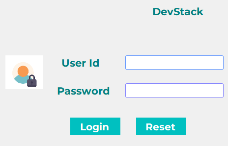
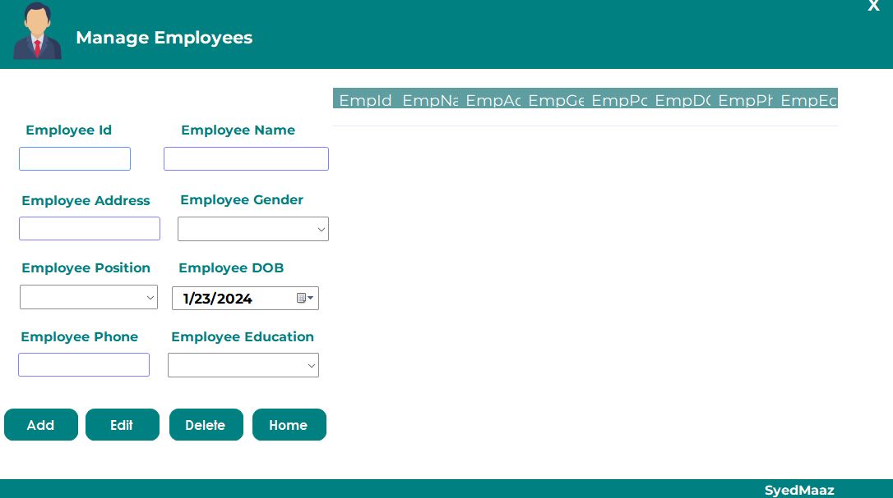
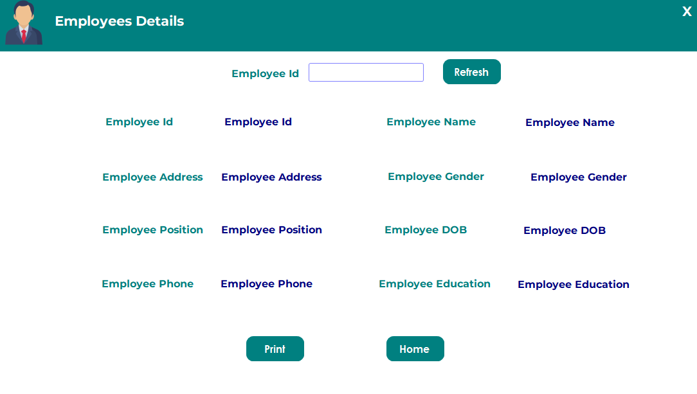
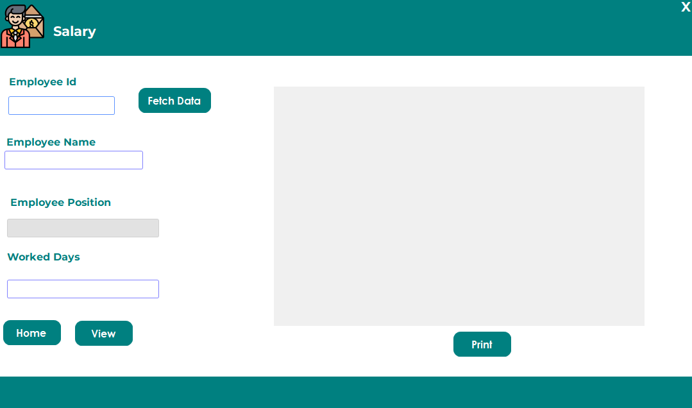

# Employees  Salary Record System

This is a simple Employee Record System designed using C# and Windows Forms. The system allows you to manage employee information, update records, delete employees, and generate salary slips.

## Project Visual Images :

Login Page: 

1.   
 
   View Employee Section:
   
3. 

   Manage Employee Section:
   
5. 

   Fetch Employee Data:
   
7. 

   Salary Dashboard:
9. 

## Features

- Add new employees with details such as ID, name, address, gender, position, date of birth, phone, and education.
- Update existing employee records.
- Delete employees from the database.
- View a summary of employee information.
- Generate and print salary slips based on the number of worked days and employee position.

## Prerequisites

- [.NET Framework](https://dotnet.microsoft.com/download) must be installed on your machine.

## Getting Started

1. Clone the repository:

   ```bash
   git clone https://github.com/syedmaazsaeed/employees-record-system.git
